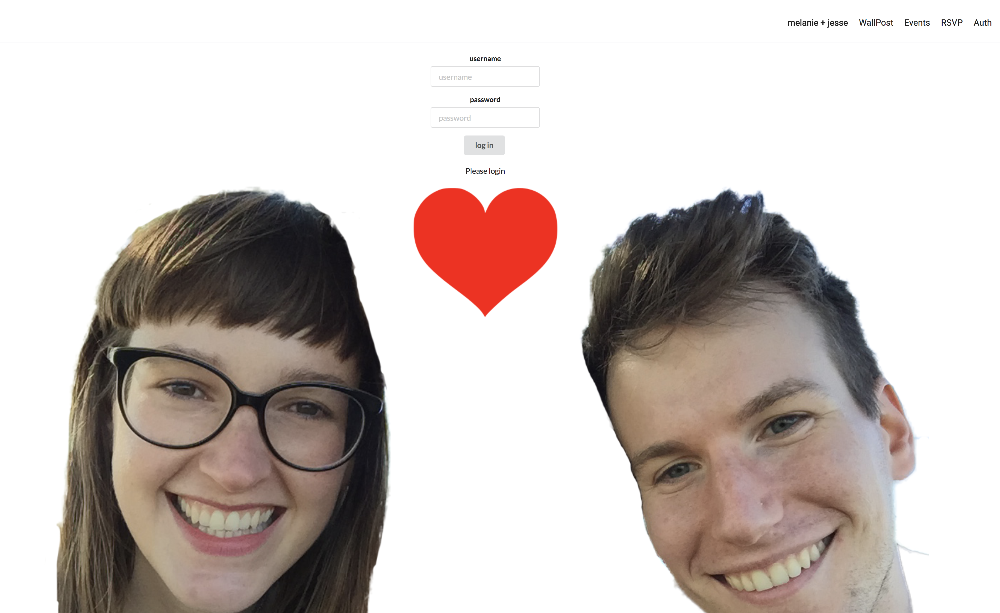

## FlatWedding - Backend
FlatWedding's backend API is Rails based. The goal is to have users login with a predetermined password (from invitations) that will give them access to a message board, schedule, registry information and an RSVP form.[Frontend](https://github.com/SuperJesseH/FlatWedding)

## Build status
This is a work in progress (with a hard deadline!) check back for updates. Currently RSVP creates a new user, this will be refactored to an update user form on the front end. Backend needs some re-working to allow users to upload photos etc.

## Screenshots

## Installation

<code>git clone https://github.com/SuperJesseH/FlatWeddingBackend</code>
<code>bundle install</code>
<code>rails s</code>

create .env file
.env contains a JWT_SECRET

Future versions will hide seeded accounts here as well

## Credits
Built by
[Jesse Horwitz](https://github.com/SuperJesseH), and [Celeste Gerard](https://github.com/celestegerard)
